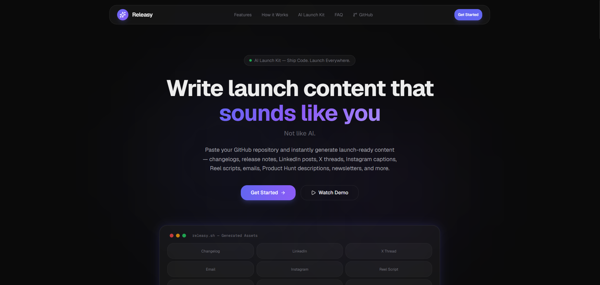
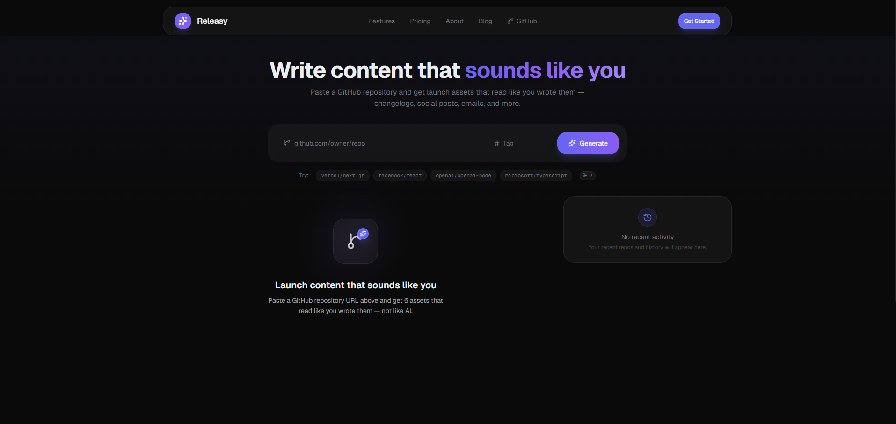
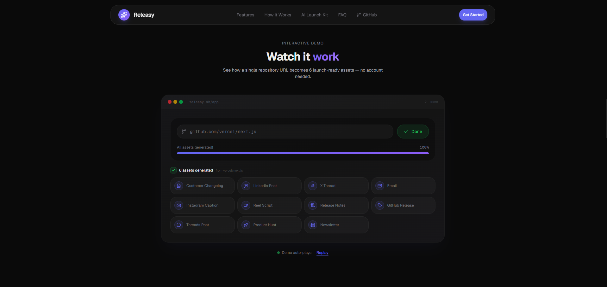
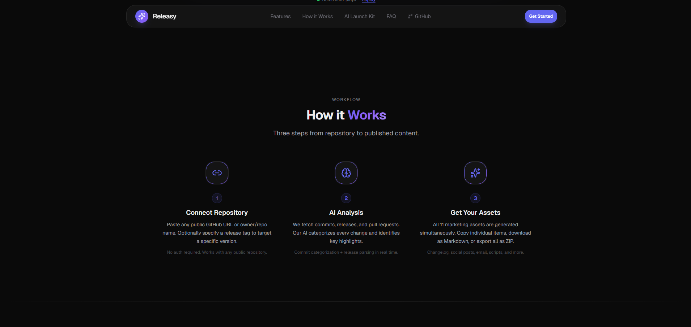
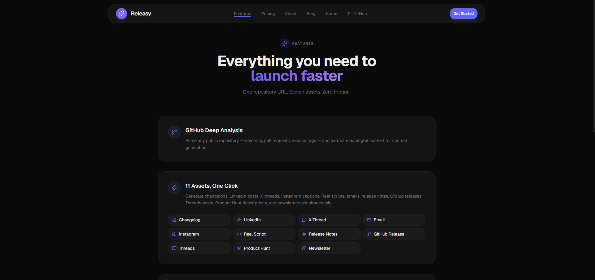

<p align="center">
  <picture>
    <source media="(prefers-color-scheme: dark)" srcset="https://img.shields.io/badge/Releasy-6366f1?style=for-the-badge&logo=github&logoColor=white">
    
  </picture>
</p>

<h1 align="center">Releasy</h1>

<p align="center">
  <em>AI-powered launch kit generator for GitHub releases</em>
</p>

<p align="center">
  Paste any GitHub repository → instantly get 6 launch-ready assets that sound like you, not like AI.
</p>

<p align="center">
  <a href="#-features">Features</a> •
  <a href="#-demo">Demo</a> •
  <a href="#-screenshots">Screenshots</a> •
  <a href="#-architecture">Architecture</a> •
  <a href="#-tech-stack">Tech Stack</a> •
  <a href="#-getting-started">Getting Started</a> •
  <a href="#-deployment">Deployment</a> •
  <a href="#-documentation">Docs</a>
</p>

<p align="center">
  <a href="https://nextjs.org"></a>
  <a href="https://www.typescriptlang.org"></a>
  <a href="https://tailwindcss.com"></a>
  <a href="https://mistral.ai"></a>
  <a href="https://opensource.org/licenses/MIT"></a>
  <a href="https://vercel.com"></a>
  <br>
  <a href="https://github.com/Saitarun29/releasy/stargazers"></a>
  <a href="https://github.com/Saitarun29/releasy/commits/main"></a>
  <a href="https://github.com/Saitarun29/releasy/blob/main/LICENSE"></a>
</p>

<br>

<p align="center">
  
</p>

---

## ✨ Features

### One Repository. Six Assets.

| Asset | Description |
|-------|-------------|
| **Customer Changelog** | Benefit-driven markdown for users. Groups changes under Added, Improved, Fixed. |
| **LinkedIn Post** | Professional launch story with a strong hook, problem-context, and engagement question. |
| **X Thread** | Multi-tweet thread. Opinionated takes under 260 chars each. No hashtags. |
| **Product Update Email** | Subject line + preview text + scannable body. One CTA only. |
| **Instagram Caption** | Founder-voice storytelling with natural emoji placement. 5-7 relevant hashtags. |
| **Instagram Reel Script** | 30-45 second shooting script with camera directions and voiceover. Hook → Problem → Solution → CTA. |

### Key Capabilities

- **GitHub Deep Integration** — Fetches releases, commits, and pull requests via the GitHub REST API
- **Smart Commit Categorization** — Automatically groups commits into Features, Bug Fixes, Performance, Refactoring, Documentation, Dependencies using regex pattern matching
- **Parallel AI Generation** — All 6 assets generated simultaneously via Mistral AI (`Promise.allSettled`)
- **Multiple Export Formats** — Copy to clipboard, download individual Markdown files, or export all as ZIP
- **One-Click Retry** — Press `Escape` or click "Generate another" to start over
- **Persistent History** — Recent repositories, favorites, and history stored in browser localStorage

---

## 🎬 Demo

<p align="center">
  
  <br>
  <em>The dashboard: paste a repo, review analysis, browse generated assets</em>
</p>

### Quick Walkthrough

```
1. Paste github.com/owner/repo → 2. AI analyzes commits & PRs → 3. Get 6 assets
```

The landing page includes an [interactive demo](./app/page.tsx) that auto-plays through the full workflow — typing a repository URL, analyzing, generating, and showing results.

---

## 📸 Screenshots

| | |
|---|---|
| **Landing Page** — Hero section with gradient text, CTA buttons, and 9-asset preview grid | **How It Works** — Three-step visual workflow diagram |
|  |  |
| **How It Works (Text)** — Step-by-step: Connect → Analyze → Generate | **Features** — 12 feature cards covering all assets and capabilities |
|  |  |
| **Dashboard** — Full app: repository form, commit analysis, categorized asset tabs, sidebar with history | |
|  | |

---

## 🏗️ Architecture

```
┌──────────────────────────────────────────────┐
│              Browser (Client)                 │
│                                              │
│  Landing Page   Dashboard    Static Pages     │
│  (RSC + anim)   (Client)     (RSC, no JS)    │
└──────────┬───────────────────────┬───────────┘
           │                       │
           ▼                       ▼
    ┌──────────────┐      ┌──────────────┐
    │  GitHub API   │      │  Next.js 16  │
    │  (unauthed)   │      │  App Router  │
    │              │      │  Server/Edge │
    │  repos/      │      │              │
    │  commits/    │      │  /api/       │
    │  releases/   │      │  generate    │
    │  pulls/      │      │  (Lambda)    │
    └──────────────┘      └──────┬───────┘
                                 │
                                 ▼
                          ┌──────────────┐
                          │  Mistral AI   │
                          │  API          │
                          │              │
                          │  6 parallel   │
                          │  generations  │
                          └──────────────┘
```

### Data Flow

```
User enters repo URL
       │
       ▼
parseRepoInput() — validates format (URL or owner/repo)
       │
       ▼
fetchRepositorySummary() — 4 parallel GitHub API calls
  ├── Repository metadata
  ├── Latest release (or by tag)
  ├── Recent commits (up to 30)
  └── Closed pull requests (up to 20)
       │
       ▼
POST /api/generate — server-side Mistral AI calls
  ├── 6 parallel prompt constructions
  ├── 6 parallel API calls (Promise.allSettled)
  ├── Content parsing + cleaning
  └── Structured response with word counts
       │
       ▼
Client renders AssetTabs with copy/download/ZIP
```

### State Machine

```
idle → loading → success → idle  (Escape key or button)
               → error   → idle  (Retry button)
```

---

## 🛠️ Tech Stack

| Layer | Technology | Purpose |
|-------|-----------|---------|
| **Framework** | [Next.js 16](https://nextjs.org) (App Router) | React framework with RSC, API routes, static generation |
| **Language** | [TypeScript](https://www.typescriptlang.org) (strict) | Type safety across the entire codebase |
| **Styling** | [Tailwind CSS v4](https://tailwindcss.com) | Utility-first CSS with custom design tokens |
| **Animation** | [Framer Motion](https://www.framer.com/motion) | Declarative animations, layout transitions, spring physics |
| **Icons** | [Lucide React](https://lucide.dev) | Consistent, lightweight icon set |
| **AI Provider** | [Mistral AI](https://mistral.ai) | Text generation for all 6 asset types |
| **Data Source** | [GitHub REST API](https://docs.github.com/en/rest) | Public repository data (no auth required) |
| **UI Primitives** | [Radix UI](https://www.radix-ui.com) | Accessible tabs, toast, and slot primitives |
| **ZIP Export** | [JSZip](https://stuk.github.io/jszip) | Client-side ZIP creation |
| **Deployment** | [Vercel](https://vercel.com) | Edge network, serverless functions, static hosting |

---

## 📁 Folder Structure

```
releasy/
├── app/                          # Next.js App Router
│   ├── api/generate/route.ts     # API endpoint (server-side AI generation)
│   ├── app/page.tsx              # Dashboard (client component)
│   ├── layout.tsx                # Root layout with SEO metadata
│   ├── globals.css               # Tailwind v4 theme + custom utilities
│   ├── page.tsx                  # Landing page
│   ├── about/                    # About page
│   ├── blog/                     # Blog (placeholder)
│   ├── contact/                  # Contact page
│   ├── features/                 # Features page
│   ├── pricing/                  # Pricing page
│   ├── privacy/                  # Privacy policy
│   └── terms/                    # Terms of service
├── assets/                       # Visual assets for README and docs
├── components/
│   ├── ui/                       # Primitives (button, card, input, tabs, toast)
│   ├── AssetTabs.tsx             # Tabbed asset viewer with category groups
│   ├── Celebration.tsx           # Particle burst effect on success
│   ├── DashboardSidebar.tsx      # Recent repos, favorites, history
│   ├── EmptyState.tsx            # Onboarding state with icon
│   ├── ErrorState.tsx            # Error display with retry
│   ├── LoadingState.tsx          # Animated progress + skeleton cards
│   ├── Navbar.tsx                # Navigation with mobile menu
│   ├── OutputCard.tsx            # Asset content with copy/download
│   ├── ReleaseTimeline.tsx       # Categorized commit timeline
│   ├── RepositoryForm.tsx        # Input form with validation
│   ├── RepositorySummary.tsx     # Repository info + stats card
│   ├── Toaster.tsx               # Toast notification renderer
│   └── Landing/                  # Landing page sections
├── constants/index.ts            # Labels, loading statuses, workflow steps
├── docs/                         # Documentation
│   ├── architecture.md           # System architecture
│   ├── system-design.md          # Component design and data flow
│   ├── api-flow.md               # API endpoint documentation
│   ├── ai-workflow.md            # Prompt engineering and generation pipeline
│   └── technical-decisions.md    # Key technical decisions and rationale
├── hooks/use-toast.ts            # Toast notification state
├── lib/
│   ├── commits.ts                # Commit categorization (regex-based)
│   ├── env.ts                    # Environment variable loader
│   ├── github.ts                 # GitHub REST API client
│   ├── mistral.ts                # Mistral AI client with retry logic
│   ├── prompts.ts                # Prompt templates for each asset type
│   ├── storage.ts                # localStorage helpers
│   ├── utils.ts                  # cn() utility (clsx + tailwind-merge)
│   └── zip.ts                    # ZIP download utility
├── types/index.ts                # TypeScript type definitions
├── .env.example                  # Environment variable template
├── .gitignore                    # Git ignore rules
├── .gitattributes                # Git attributes (LF normalization)
├── CHANGELOG.md                  # Version history
├── CODE_OF_CONDUCT.md            # Contributor covenant
├── CODEOWNERS                   # Code ownership
├── CONTRIBUTING.md               # Contribution guide
├── LICENSE                       # MIT license
├── SECURITY.md                   # Security policy
├── SUPPORT.md                    # Support information
├── package.json                  # Dependencies and scripts
└── tsconfig.json                 # TypeScript configuration
```

---

## 🚀 Getting Started

### Prerequisites

- [Node.js](https://nodejs.org) 20 or later
- npm (ships with Node.js)
- A [Mistral AI API key](https://console.mistral.ai/api-keys/) (free tier available)

### Quick Start

```bash
# Clone the repository
git clone https://github.com/Saitarun29/releasy.git
cd releasy

# Install dependencies
npm install

# Configure environment
cp .env.example .env.local
# Edit .env.local and add your Mistral AI API key:
#   MISTRAL_API_KEY=your_key_here

# Start development server
npm run dev
```

Open [http://localhost:3000](http://localhost:3000) in your browser.

### Environment Variables

| Variable | Required | Default | Description |
|----------|----------|---------|-------------|
| `MISTRAL_API_KEY` | Yes | — | Mistral AI API key (get one at [console.mistral.ai](https://console.mistral.ai/api-keys/)) |
| `MISTRAL_MODEL` | No | `mistral-small-latest` | Mistral model identifier |

### Production Build

```bash
npm run build   # Compiles and optimizes
npm start       # Serves production build
```

### Verification

```bash
npm run lint    # Should exit with 0 errors
npm run build   # Should compile 13 routes with 0 errors
```

---

## ▲ Deployment

### Deploy on Vercel

[](https://vercel.com/new)

1. Push the repository to GitHub
2. Import into [Vercel](https://vercel.com/new)
3. Add environment variables:
   - `MISTRAL_API_KEY` — your Mistral AI key
4. Deploy

**No additional infrastructure required.** No database, no filesystem writes, no background jobs. The app runs entirely on Vercel's edge network.

---

## 📖 Documentation

| Document | Description |
|----------|-------------|
| [Architecture](./docs/architecture.md) | High-level system architecture and design decisions |
| [System Design](./docs/system-design.md) | Component hierarchy, page routing, and data flow |
| [API Flow](./docs/api-flow.md) | API endpoint specification and sequence diagrams |
| [AI Workflow](./docs/ai-workflow.md) | Prompt engineering, generation pipeline, and retry strategy |
| [Technical Decisions](./docs/technical-decisions.md) | Rationale for framework, provider, and tooling choices |

---

## 💡 Why I Built This

Every time I shipped a release, I found myself writing the same content in different formats — a changelog for docs, a tweet for X, a post for LinkedIn, an email for users. Each platform demanded a different tone, structure, and length.

I realized AI could do this instantly if it understood the code changes. So I built Releasy: a tool that reads your repository, understands what changed, and generates a complete launch kit.

What started as a weekend project became a deeper exploration of:

- **Prompt engineering** — How to craft system prompts that produce consistent, high-quality content without hallucination
- **Parallel API orchestration** — Managing concurrent AI calls with graceful partial failure handling
- **Server component architecture** — Building a modern Next.js app that renders zero-JS static pages alongside interactive client components
- **Error-resilient design** — Creating meaningful error states for API failures, rate limits, and network issues

---

## 🧠 Prompt Engineering Approach

Each of the 6 asset types has a dedicated prompt template in [`lib/prompts.ts`](./lib/prompts.ts). The prompts share a common structure:

1. **System role** — Personifies the AI as a founder
2. **Context block** — Repository metadata + categorized commits
3. **Format rules** — Length limits, banned words, structural requirements
4. **Output constraints** — No markdown fences, no explanations, return only the content

[Read the full AI workflow documentation →](./docs/ai-workflow.md)

---

## ⚖️ Design Decisions

| Decision | Choice | Rationale |
|----------|--------|-----------|
| Framework | Next.js 16 App Router | RSC for static pages, API routes co-located, route-level code splitting |
| AI Provider | Mistral AI | Cost-effective, fast (~3s response), comparable quality to GPT-3.5 |
| Authentication | None | Portfolio project. No database, user management, or session overhead. |
| State Persistence | localStorage | User data stays in browser. No backend needed. Device-specific. |
| GitHub Auth | Unauthenticated | Public repos only. Simpler deployment. Rate limits handled gracefully. |
| Component Library | Custom Radix + Tailwind | Full control over design system. No heavy UI framework dependency. |

[Read all technical decisions →](./docs/technical-decisions.md)

---

## 🚧 Future Improvements

- [ ] Private repository support (GitHub token authentication)
- [ ] Custom brand voice configuration
- [ ] Webhook-based auto-generation on new releases
- [ ] Direct publishing to GitHub, LinkedIn, X
- [ ] Multi-language content generation
- [ ] Team workspaces with shared templates
- [ ] API access for programmatic generation

---

## 🤝 Contributing

Contributions are welcome. Please read:

1. [CONTRIBUTING.md](./CONTRIBUTING.md) — Development setup and workflow
2. [CODE_OF_CONDUCT.md](./CODE_OF_CONDUCT.md) — Community guidelines
3. [docs/](./docs/) — Architecture and design documentation

### Quick Start for Contributors

```bash
npm install
cp .env.example .env.local  # Add your Mistral API key
npm run dev
npm run lint                 # Before committing
npm run build                # Before opening a PR
```

---

## 📄 License

MIT © [Sai Tarun](https://github.com/Saitarun29). See [LICENSE](./LICENSE) for details.

---

<p align="center">
  Built with TypeScript, Next.js, and Mistral AI.
  <br>
  <a href="https://github.com/Saitarun29/releasy">GitHub</a> •
  <a href="#-features">Features</a> •
  <a href="#-documentation">Docs</a> •
  <a href="#-getting-started">Quick Start</a>
</p>
